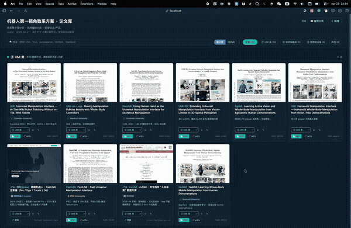
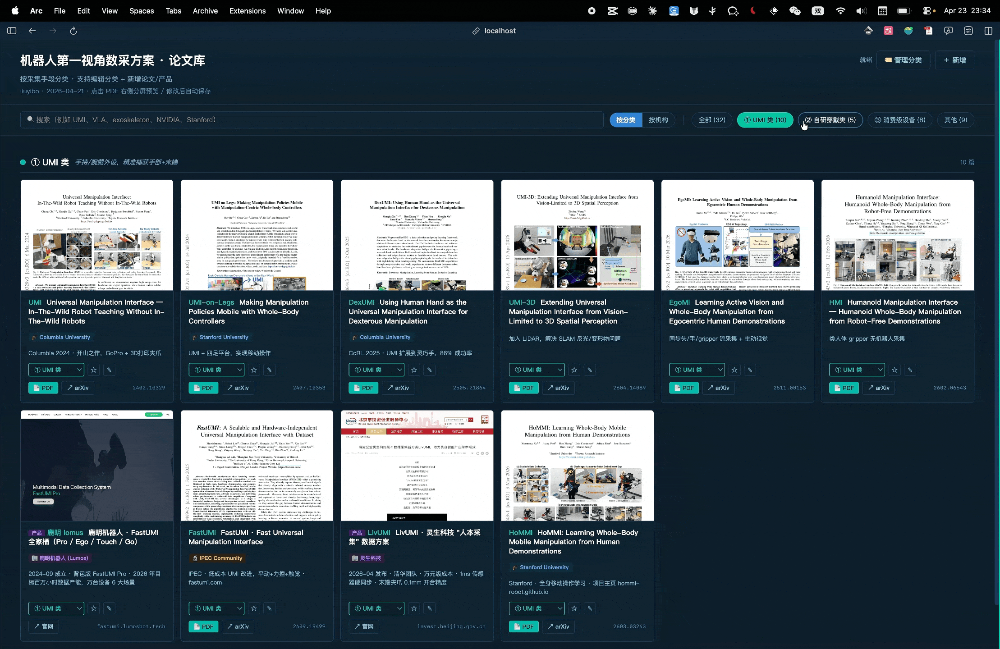
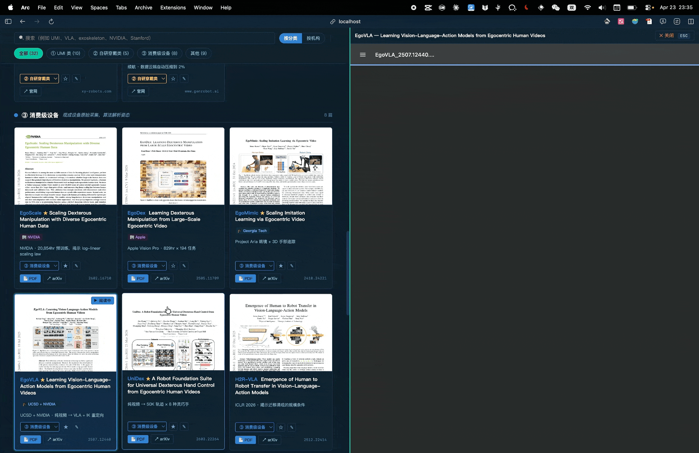

# Paper Library Kit

我们大量跟进某个领域的论文时，下载的文论文堆在一起很容易眼花缭乱。**Paper Library Kit** 则提供一种「电影墙」式的管理方式：

- 每篇论文有封面缩略图 + 标签分类，一眼联想内容
- 本地 PDF 分屏阅读，不用在多个页面跳来跳去
- 告诉 AI 一个 arXiv 链接，自动下载 PDF、生成缩略图、填写基本信息

整个系统由 **AI Agent 驱动**——你只需要说话，AI 做事。

| 论文墙 | 分类筛选 | 分屏查看 |
|:---:|:---:|:---:|
|  |  |  |

# 使用方式
打开你的 AI 助手（Claude Code、Cursor 等支持工具调用的 AI Agent），对他说：
> 基于这个开源库帮我初始化一个论文库：https://github.com/doubleLLL3/paper-library-kit

AI 会接管后续所有步骤，只在必要时向你提问。

日常使用，可以直接说：
> 帮我添加这篇论文：http://xxx (论文地址)
> 帮我深度阅读这篇论文：http://xxx (论文地址) / xxx (论文名称)
> ...

🎉 更多使用方式等待您开发！

---

> 以下为 AI 执行指南。当用户说「基于这个库帮我初始化」时，从这里开始执行。

## AI 初始化流程

用户不需要懂编程，你来负责所有操作，只在必要时问用户几个问题。

### 第 1 步：确认安装位置

询问用户：
> "你想把论文库安装在哪里？没有特别想法直接说「好」，默认安装到 `~/paper-library`"

```bash
git clone https://github.com/doubleLLL3/paper-library-kit ~/paper-library
cd ~/paper-library
```

### 第 2 步：检查依赖

```bash
python3 --version   # 必须，无需安装其他包

# poppler（生成封面缩略图）
command -v pdftoppm || brew install poppler        # macOS
command -v pdftoppm || sudo apt-get install -y poppler-utils   # Linux
```

### 第 3 步：问用户 2 个问题

依次提问，等用户回答再问下一个：

**问题 1 — 库的名字**
> "你想给这个论文库起什么名字？不想改直接说「好」，默认叫 Paper Library"

**问题 2 — 现有 PDF 文件夹**
> "你有没有一个已经装了 PDF 的文件夹？有的话告诉我路径（比如 ~/Downloads/papers），没有直接说「没有」"

### 第 4 步：写入配置

更新 `papers.json` 里的 `meta` 字段：
```json
{
  "meta": {
    "title": "用户给的名字",
    "subtitle": "按分类浏览 · 由 Claude Code 维护"
  }
}
```

### 第 5 步：批量导入现有 PDF（如果用户有）

扫描用户提供的文件夹，对每个 PDF 文件：
1. 用正则 `\b(\d{4}\.\d{4,5})\b` 从文件名中提取 arXiv ID
2. 调用 `https://export.arxiv.org/abs/{id}` 获取标题、作者、摘要
3. 复制 PDF 到 `references/`，用 `scripts/gen_thumb.sh` 生成缩略图
4. 写入 `papers.json`

最后汇报：成功 N 篇 / 未识别 M 篇（列出文件名）。

### 第 6 步：启动服务器

```bash
bash start.sh
```

### 第 7 步：告诉用户

> "论文库已准备好，浏览器打开 http://localhost:8765 即可使用。
> 之后想加论文，直接告诉我论文链接就行。"

---

## 日常使用（初始化完成后）

详细操作手册见 `CLAUDE.md`，涵盖：添加论文、批量导入、写深度笔记、管理分类。

---

## 非 AI 用户使用

不使用 AI 也可以独立运行和维护论文库。

### 快速启动

```bash
git clone https://github.com/doubleLLL3/paper-library-kit ~/paper-library
cd ~/paper-library
pip install -r requirements.txt
bash start.sh
# 浏览器打开 http://localhost:8765
```

### 添加论文

点击页面右上角「📁 本地导入」按钮：

1. 拖拽或点击选择本地 PDF 文件
2. 缩略图自动生成，无需额外操作
3. 按需填写标题、简称、arXiv ID 等（均为选填，只有 PDF 是必须的）
4. 点击「导入」——卡片立即出现在论文墙

### 其他操作

- **管理分类**：点击「🏷️ 管理分类」新增 / 编辑 / 删除分类
- **编辑论文**：点卡片上的 ✎ 按钮
- **分屏阅读**：点论文卡片的缩略图或「📄 PDF」按钮
- **停止服务**：`bash stop.sh`

---

## 支持作者

这个项目完全免费开源。如果它帮你节省了整理论文的时间，欢迎请作者喝杯咖啡 ☕


## License

MIT
